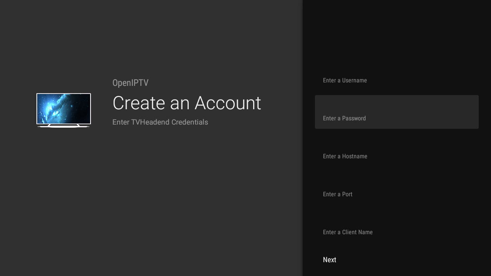
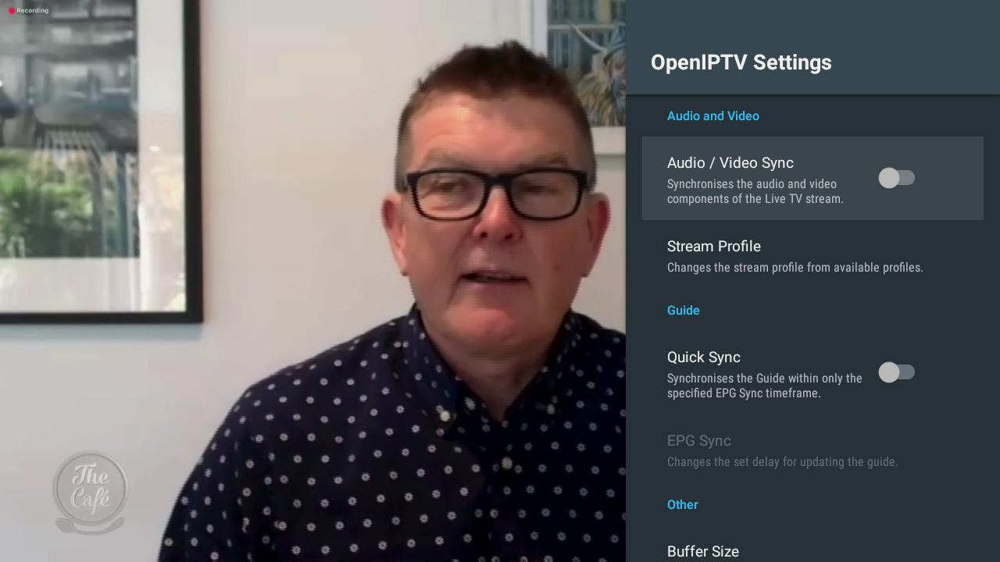
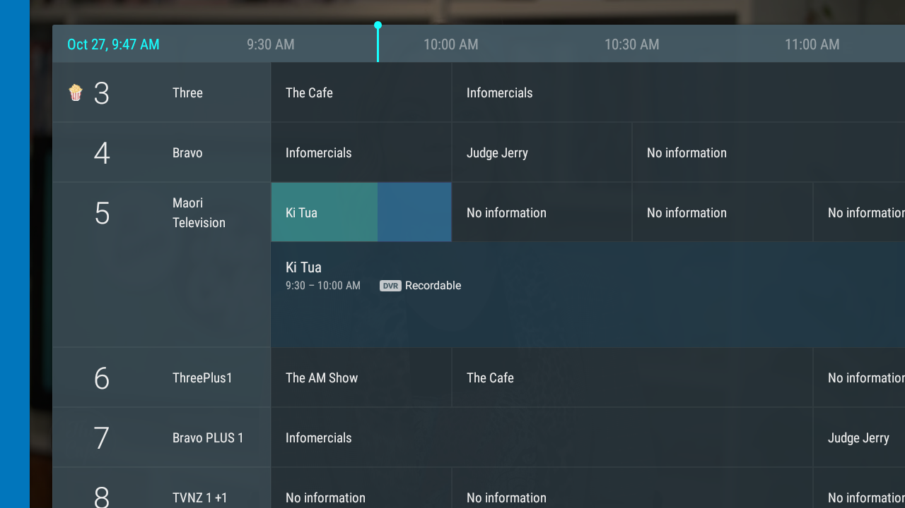

# OpenIPTV
OpenIPTV is a Solution that allows users to stream content from an IPTV server
to their Android TVs.

There are very few options available when you are trying to stream IPTV content
using free and open source software. The goal of this solution is to provide a
free and open-source IPTV streaming application that is simple to use and has
many features that other, commercial solutions have.

Currently TVHeadEnd using HTSP is the only supported IPTV server at the moment.

## Features

* Timeshift (fast-forwarding & rewinding) is working for servers with this enabled
* Multiple user accounts supported
* DVR recordings supported
* Changing stream quality
* Changing the stream language
* Playing back DVR recordings
* Parental Controls using OMBD TV-Rating API (Requires API which can be obtained for free via: http://www.omdbapi.com/apikey.aspx)
* Program Guide
* Time lock to restrict viewing hours
* Category view for the guide

## Requirements

Android SDK API level 26
Android Studio
To use the Parental Controls, OMDBApi TV-Rating API Key is also needed.

## Installation

Open the project folder in android studio and make sure that Android SDK API level 26 (Android 8) is enabled.
Then click the build button.
Gradle should then handle all required dependencies.

## Usage

For use with an TVHeadEnd Server.
When launching the application for the first time (from the live TV application) a setup wizard will guide you through adding a new TVHeadEnd Server.
If the application cannot successfully connect to the server during the setup wizard, it will show a message and will not continue until you give it a valid server.
After the setup, the content from the IPTV server should start playing

## Support

Should you encounter any bugs, or problems using the application, try opening a new ticket in the issue tracker.
Be sure to describe what you were doing and what you were trying to do at the time the error occured.

## Contributing

We are currently not open for contributions.
This will change in the future.

## License

Licensed under the MIT License, https://mit-license.org/
